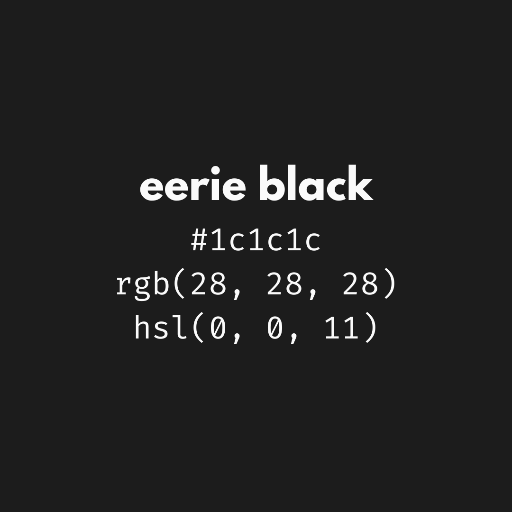
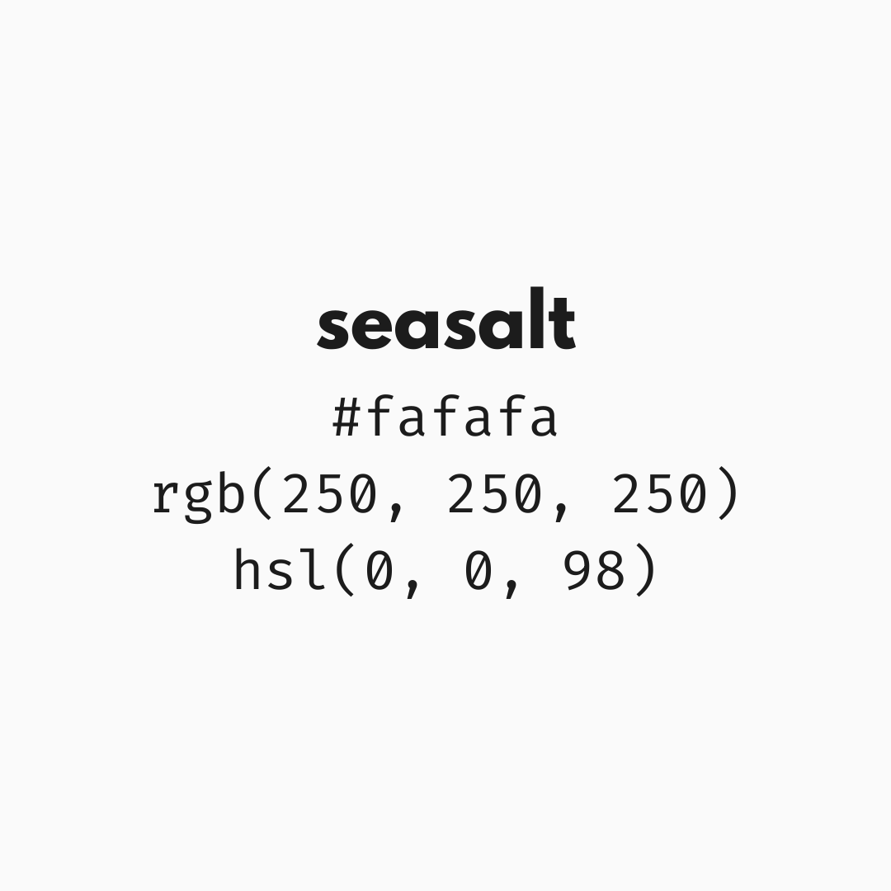
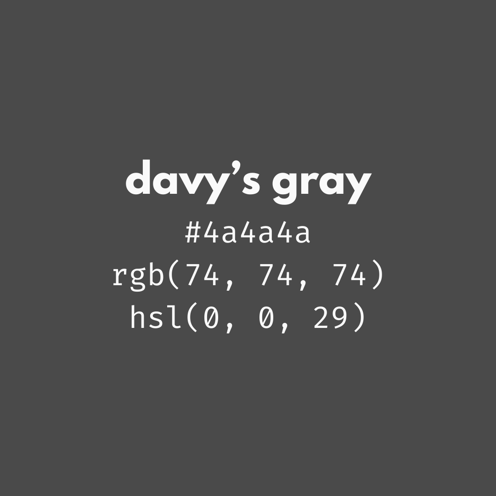
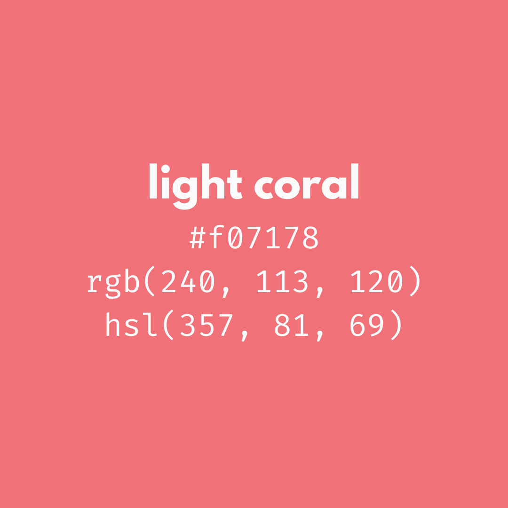
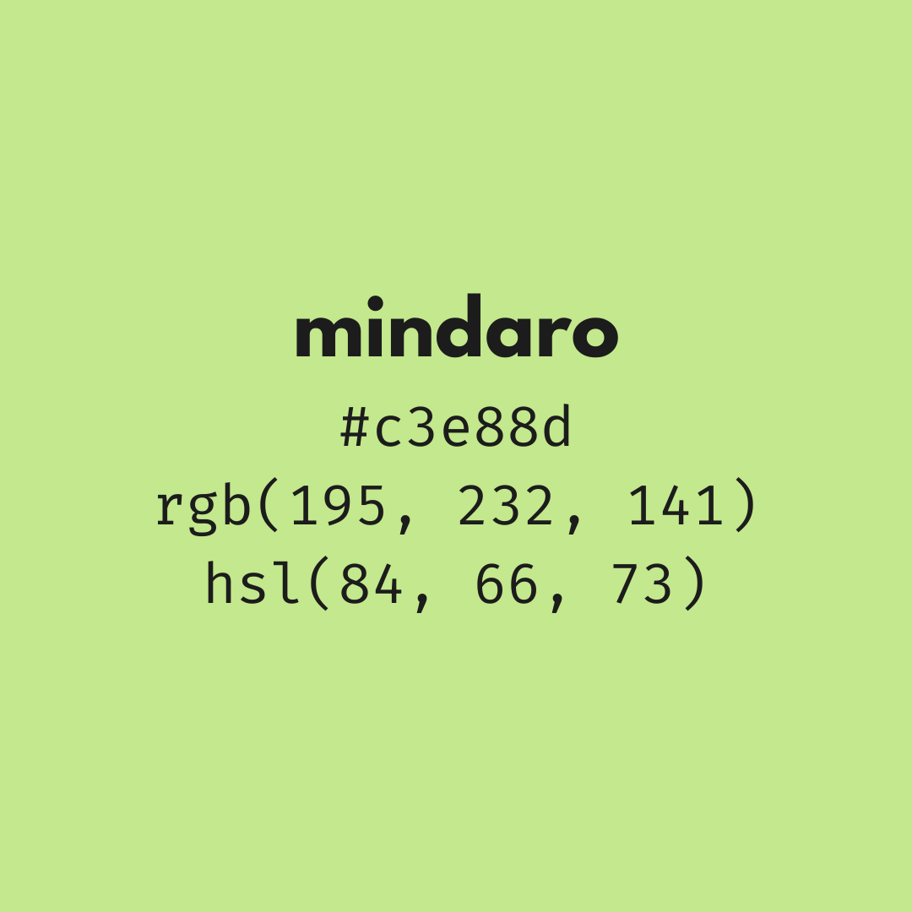
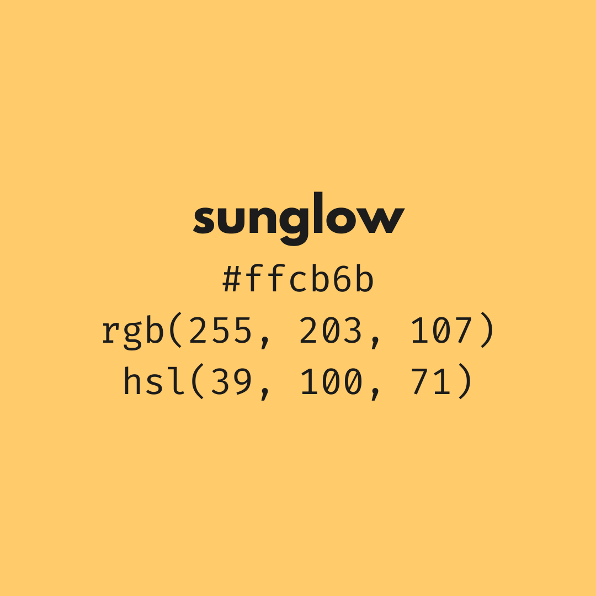
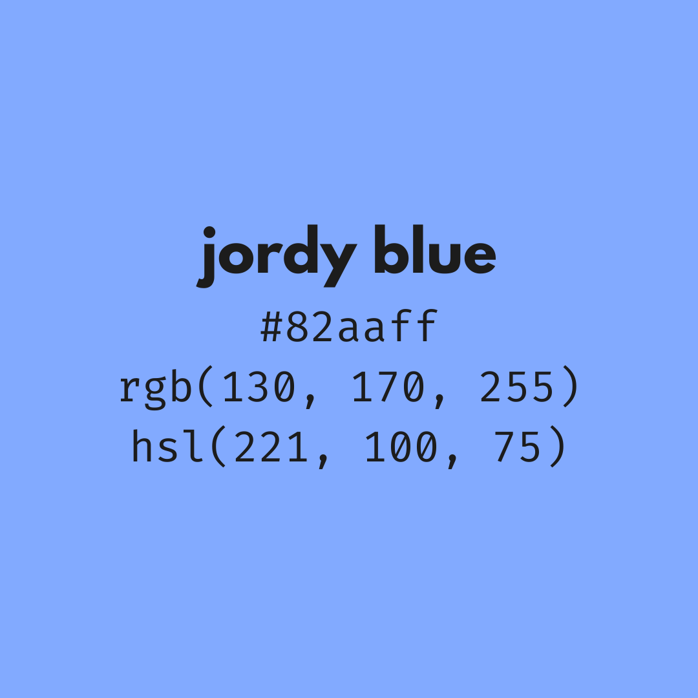
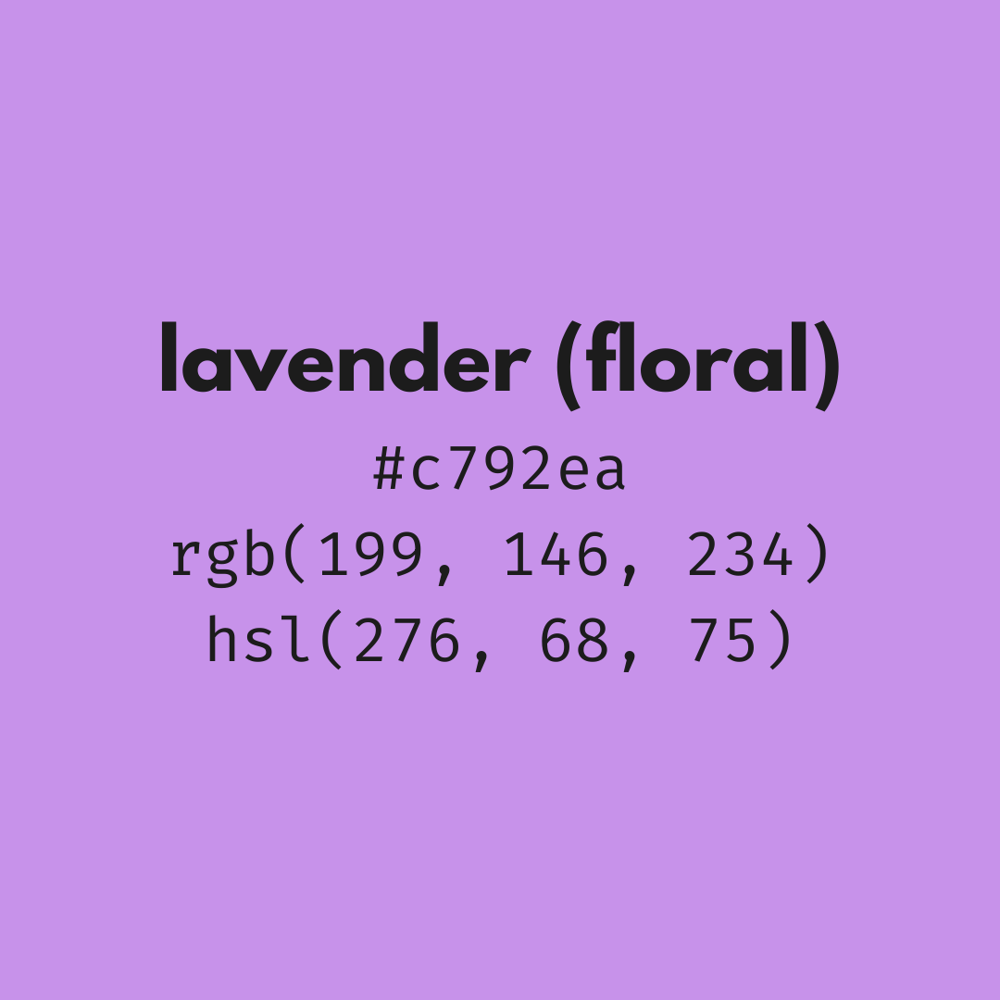
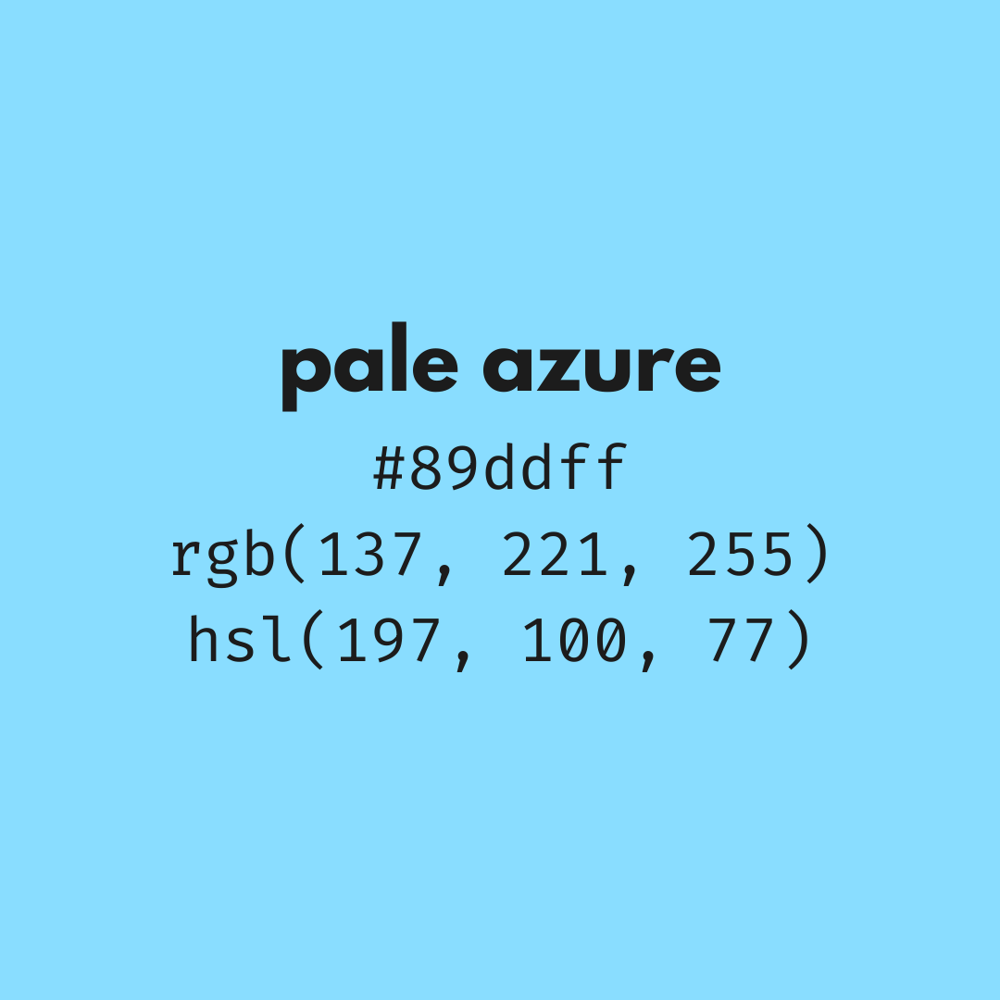
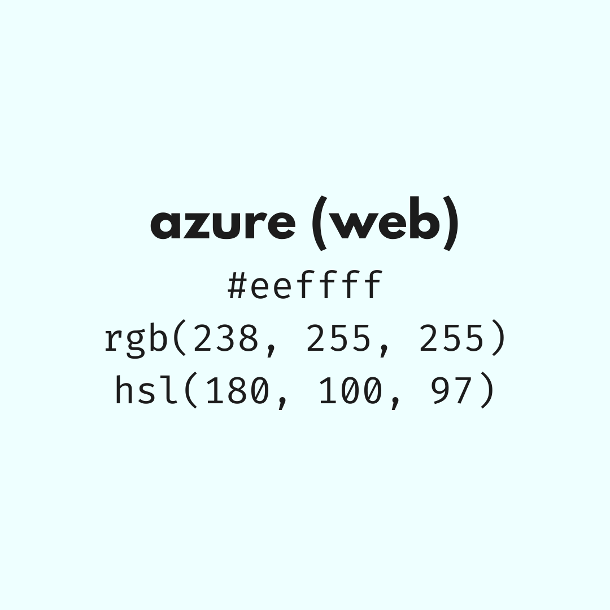

    <h2>A fast access repo for Material Darker color scheme (probably the first on the internet)</h2>
<table>
<tr>
<th> Sample </th>
<th> Hex </th>
<th> RGB </th>
<th> HSL </th>
</tr>
<tr>
<td>   Eerie black </td>
<td valign="middle"><code>#1C1C1C</code></td>
<td valign="middle"><code>rgb(28, 28, 28)</code></td>
<td valign="middle"><code>hsl(0, 0, 11)</code></td>
</tr>
<tr>
<td>   Seasalt </td>
<td valign="middle"><code>#FAFAFA</code></td>
<td valign="middle"><code>rgb(250, 250, 250)</code></td>
<td valign="middle"><code>hsl(0, 0, 98)</code></td>
</tr>
<tr>
<td>   Davy's gray </td>
<td valign="middle"><code>#4A4A4A</code></td>
<td valign="middle"><code>rgb(74, 74, 74)</code></td>
<td valign="middle"><code>hsl(0, 0, 29)</code></td>
</tr>
<tr>
<td>   Light coral </td>
<td valign="middle"><code>#F07178</code></td>
<td valign="middle"><code>rgb(240, 113, 120)</code></td>
<td valign="middle"><code>hsl(357, 81, 69)</code></td>
</tr>
<tr>
<td>   Mindaro </td>
<td valign="middle"><code>#C3E88D</code></td>
<td valign="middle"><code>rgb(195, 232, 141)</code></td>
<td valign="middle"><code>hsl(84, 66, 73)</code></td>
</tr>
<tr>
<td>   Sunglow </td>
<td valign="middle"><code>#FFCB6B</code></td>
<td valign="middle"><code>rgb(255, 203, 107)</code></td>
<td valign="middle"><code>hsl(39, 100, 71)</code></td>
</tr>
<tr>
<td>   Jordy blue </td>
<td valign="middle"><code>#82AAFF</code></td>
<td valign="middle"><code>rgb(130, 170, 255)</code></td>
<td valign="middle"><code>hsl(221, 100, 75)</code></td>
</tr>
<tr>
<td>   Lavender (floral) </td>
<td valign="middle"><code>#C792EA</code></td>
<td valign="middle"><code>rgb(199, 146, 234)</code></td>
<td valign="middle"><code>hsl(276, 68, 75)</code></td>
</tr>
<tr>
<td>   Pale azure </td>
<td valign="middle"><code>#89DDFF</code></td>
<td valign="middle"><code>rgb(137, 221, 255)</code></td>
<td valign="middle"><code>hsl(197, 100, 77)</code></td>
</tr>
<tr>
<td>   Azure (web) </td>
<td valign="middle"><code>#EEFFFF</code></td>
<td valign="middle"><code>rgb(238, 255, 255)</code></td>
<td valign="middle"><code>hsl(180, 100, 97)</code></td>
</tr>
</table>
More file formats will come soon, star the repo and stay tuned!
